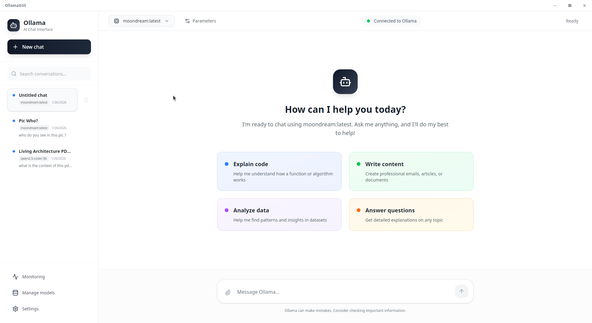
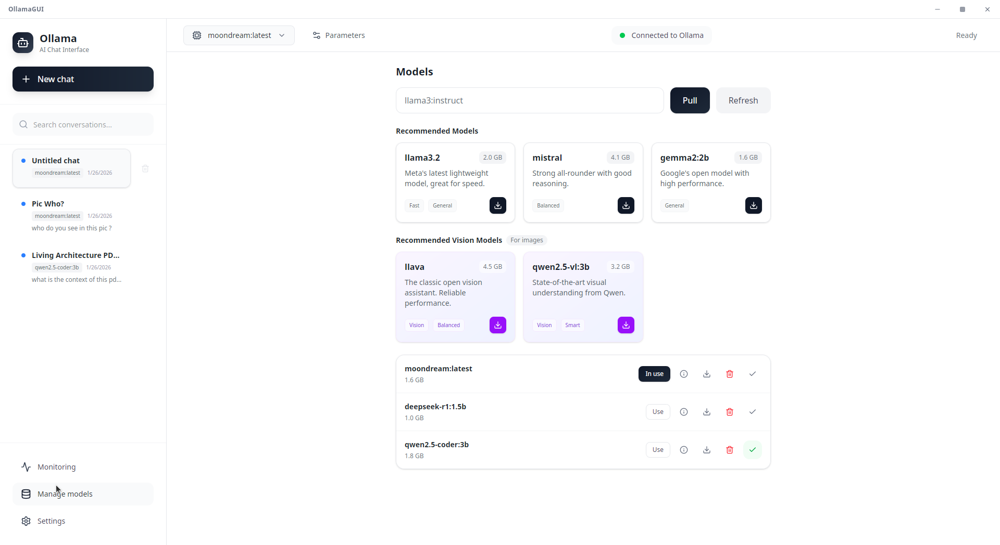
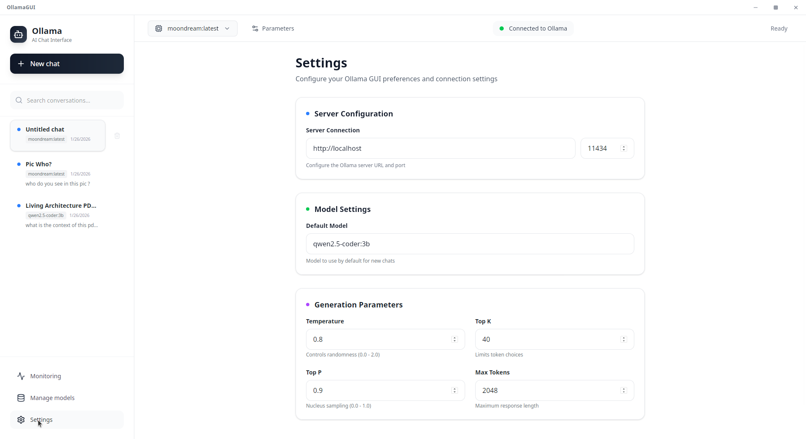
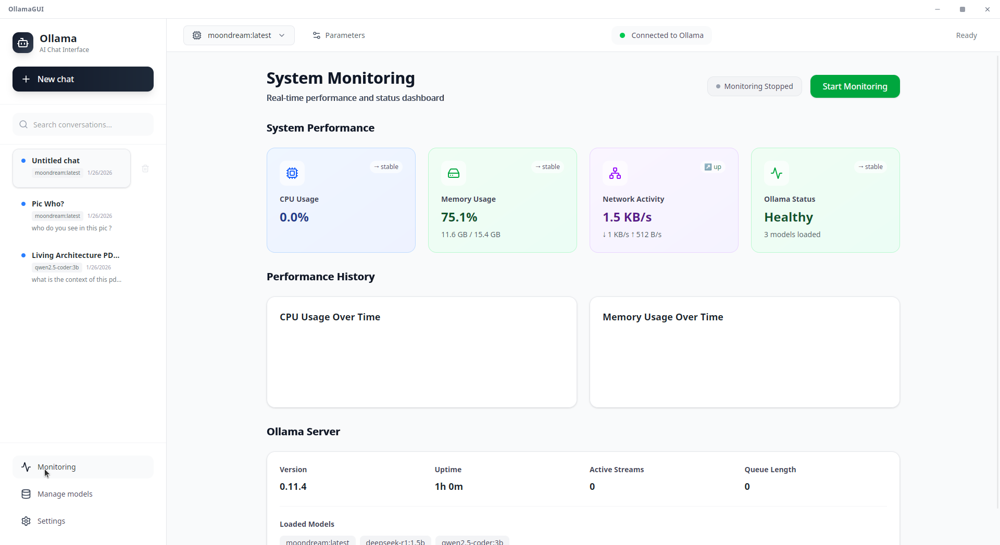
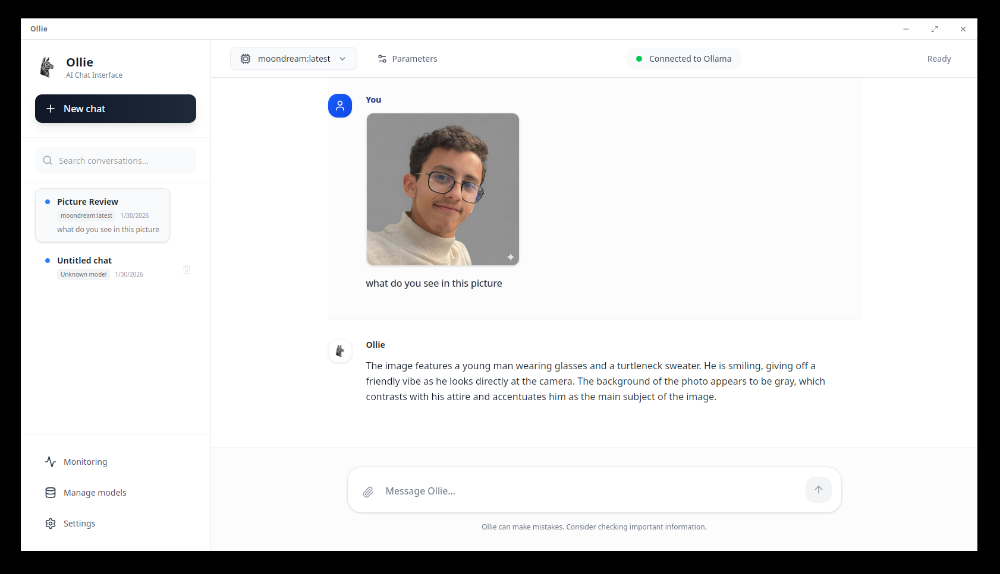

<div align="center">

<table>
  <tr>
    <td align="center" width="180">
      
    </td>
    <td align="left">
<pre>
  .----------------.  .----------------.  .----------------.  .----------------.  .----------------. 
| .--------------. || .--------------. || .--------------. || .--------------. || .--------------. |
| |     ____     | || |   _____      | || |   _____      | || |     _____    | || |  _________   | |
| |   .'    `.   | || |  |_   _|     | || |  |_   _|     | || |    |_   _|   | || | |_   ___  |  | |
| |  /  .--.  \  | || |    | |       | || |    | |       | || |      | |     | || |   | |_  \_|  | |
| |  | |    | |  | || |    | |   _   | || |    | |   _   | || |      | |     | || |   |  _|  _   | |
| |  \  `--'  /  | || |   _| |__/ |  | || |   _| |__/ |  | || |     _| |_    | || |  _| |___/ |  | |
| |   `.____.'   | || |  |________|  | || |  |________|  | || |    |_____|   | || | |_________|  | |
| |              | || |              | || |              | || |              | || |              | |
| '--------------' || '--------------' || '--------------' || '--------------' || '--------------' |
 '----------------'  '----------------'  '----------------'  '----------------'  '----------------' 
</pre>
    </td>
  </tr>
</table>

# Ollie — Your Friendly Local AI Companion

</div>

**Ollie** (formerly OllamaGUI) is a personal AI assistant you run on your own Linux machine. It provides a polished, modern interface for chatting with local LLMs via Ollama—no CLI required.

If you want a personal, single-user assistant that feels premium, fast, and always-on, this is it.



## Install (Linux AppImage)

No configuration needed. Just download and run.

```bash
wget -O Ollie.AppImage https://github.com/MedGm/OllamaGUI/releases/latest/download/Ollie_*_amd64.AppImage
chmod +x Ollie.AppImage
./Ollie.AppImage
```

*Requirements: [Ollama](https://ollama.com) installed and running.*

## Highlights

**Local-First Experience**
Ollie runs entirely on your machine. Your chats, data, and models stay private. No cloud dependencies, no tracking.

**Modern Chat Interface**
A clean, distraction-free UI built with React and Tailwind. Supports full Markdown rendering, code highlighting, tables, and math equations.

**Model Management**
Pull, delete, and manage your Ollama models directly from the app. No need to drop to the terminal.

**Vision & File Analysis**
Drag and drop images to analyze them with vision models like LLaVA. Upload PDFs and text files to chat with your documents instantly.

**Monitoring Dashboard**
Real-time tracking of your system resources (CPU, Memory) and model performance while generating responses.

## Gallery

| Models | Settings |
|:---:|:---:|
|  |  |

| Monitoring | Vision |
|:---:|:---:|
|  |  |

## Tech Stack

- **Frontend**: React 19, TypeScript, Tailwind CSS v4
- **Backend**: Tauri v2 (Rust)
- **Database**: SQLite (local persistence)

## Data & Configuration

- **Local Database**: `~/.config/ollie/app.db`
- **Settings**: `~/.config/ollie/settings.json`

## Roadmap

### ✅ Recently Completed

- **Message Editing**: Edit sent messages and regenerate responses from any point.
- **Real-time HTML Preview**: Instant rendering of HTML/SVG artifacts directly in chat.
- **Think Mode**: Toggle visibility for reasoning models' thought processes.

### 🚀 Upcoming Features

**Quick Wins**
- **Ollama Library Browser**: Browse available models directly from [ollama.com/library](https://ollama.com/library) in the pull dialog.
- **Export/Import Conversations**: Export chats as Markdown, JSON, or PDF. Import from ChatGPT/Claude formats.
- **Keyboard Shortcuts**: `Ctrl+N` new chat, `Ctrl+K` model switch, `Ctrl+/` focus input, and customizable keybindings.
- **Image/SVG Export**: Download HTML preview artifacts as PNG or SVG files.

**Core & Chat**
- **Structured Outputs**: Support for JSON schemas and tool calling.
- **Conversation Branching**: Fork conversations from any point.
- **Multi-Model Comparison**: Send same prompt to multiple models, compare responses side-by-side.
- **Prompt Templates Library**: Pre-built and user-created templates with variables.

**Developer Tools**
- **GitHub Integration**: Fetch repos for context, analyze PRs, export code to Gists.
- **RAG / Document Memory**: Index local folders, chat with your codebase using embeddings.
- **Local Code Sandbox**: Run Python/JavaScript code blocks in isolated environment with inline output.

**Agents & Models**
- **Agent Store**: One-click installation of prebuilt agents (coding, writing, etc.).
- **Model Factory**: Create and push custom Modelfiles directly from the UI.
- **Custom Agents**: Configure specific system prompts and behaviors per chat.

**Platform & Integration**
- **MCP Support**: Connect to external tools via Model Context Protocol servers.
- **Ollama Server Discovery**: Auto-detect and connect to Ollama instances on local network.
- **Cloud API Support**: Integrate Anthropic/OpenAI alongside local models.
- **Voice Mode**: Hands-free voice interaction.
- **Mobile Companion App**: iOS/Android versions.
- **Plugin System**: Extend functionality with community plugins.
- **Internationalization**: Multi-language UI support.

## License

MIT License. Created by @MedGm.
